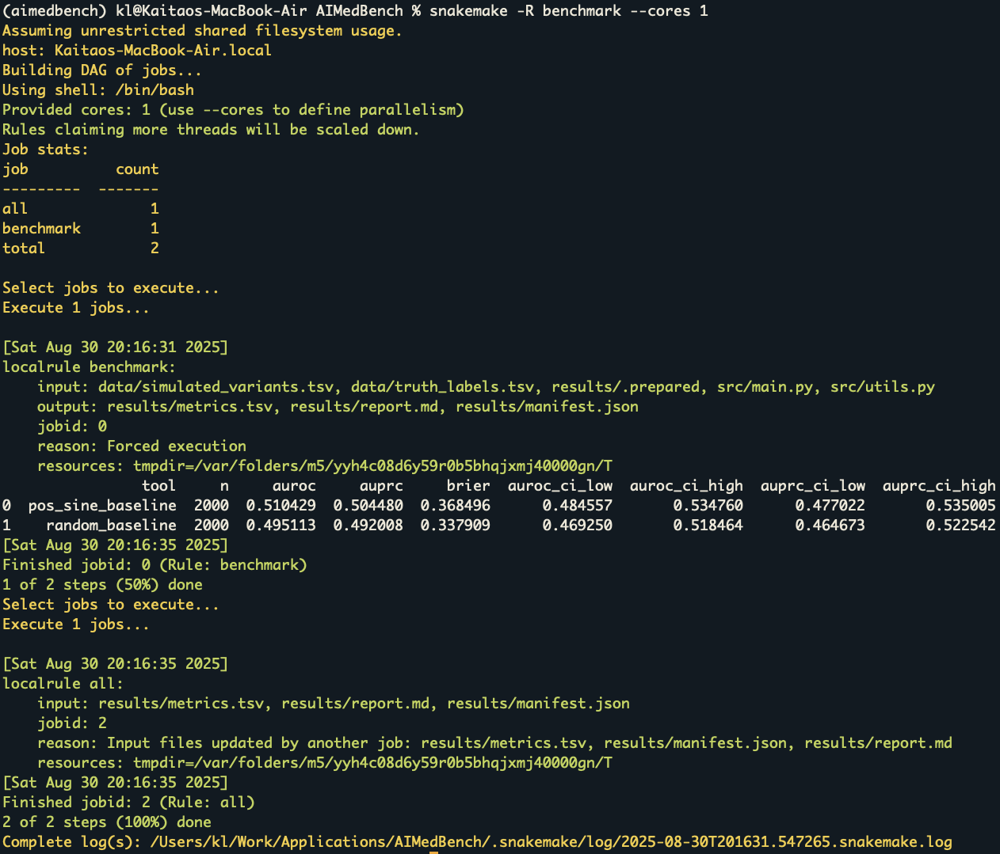

# AIMedBench: Rigorous Evaluation of AI/ML Tools in Rare Disease Genomics

This repository demonstrates **how to rigorously evaluate third-party AI/ML tools** for **rare disease diagnostics** — focusing on  
**reproducibility, fairness, clinical translation, and safety**. It’s intentionally lightweight so reviewers can run it quickly.

> ⚡ Note: This is an **evaluation framework**, not a method development project.  
> Demo baselines (e.g. random, position-based) are included only to illustrate the pipeline; the primary purpose is to benchmark **external AI/ML tools**.

---

## What’s here
- `docs/` — concise design docs: tool landscape, evaluation framework, cloud/HPC feasibility.
- `workflow/` — a Snakemake pipeline running a reproducible demo benchmark end-to-end.
- `src/` — clear Python scripts: data IO, baselines (demo only), metric computation, and report generation.
- `data/` — tiny example datasets (synthetic + ClinVar-style) for fast demo runs.
- `notebooks/` — minimal notebooks for quick visualization and “drop-in predictions” examples.
- `results/` — pipeline outputs: metrics tables, plots, and reports.

---

## 📂 Repository Structure

```
AIMedBench/
├── README.md                         # Project overview and usage instructions
├── LICENSE                           # Open-source license (MIT)
├── .gitignore                        # Files and directories ignored by Git
├── pyproject.toml                     # Python project metadata and dependencies
├── Dockerfile                        # Container image definition for reproducible runs
├── envs/
│   └── environment.yml               # Conda environment specification
├── docs/
│   ├── 01_landscape.md               # Survey of external AI/ML tools to evaluate
│   ├── 02_framework.md               # Evaluation framework (datasets, metrics, clinical vs research priorities)
│   ├── 03_feasibility.md             # Cloud/HPC feasibility and deployment considerations
│   └── Artificial_Intelligence_and_Machine_Learning_in_Bioinformatics-Kaitao_Lai.pdf
│                                     # Reference paper (2018 book chapter)
├── workflow/
│   └── Snakefile                     # Snakemake workflow for running benchmarks end-to-end
├── src/
│   ├── utils.py                      # Helper functions (e.g., build variant IDs)
│   ├── predictions_random.py         # Demo baseline predictor (random scores)
│   ├── predictions_position.py       # Demo baseline predictor (position-based heuristic)
│   ├── aggregate.py                  # Functions to load and merge external tool predictions
│   ├── evaluate.py                   # Metric computation (AUROC, AUPRC, Brier score, etc.)
│   ├── report.py                     # Report generation (Research vs Clinical metrics sections)
│   └── main.py                       # Main pipeline script to run evaluation + reporting
├── data/
│   ├── simulated_variants.tsv        # Synthetic toy variants (demo input)
│   ├── clinvar_tiny.tsv              # Tiny ClinVar-style dataset (pathogenic vs benign)
│   └── truth_labels.tsv              # Ground-truth labels for demo evaluation
├── predictions/
│   └── external/
│       └── spliceai_sample.csv       # Example external tool predictions (SpliceAI demo)
├── notebooks/
│   ├── spliceai_demo.ipynb           # Jupyter notebook: evaluate SpliceAI predictions
│   └── benchmark_dashboard.ipynb     # Jupyter notebook: simple dashboard of results
├── results/                          # Auto-generated outputs from pipeline
│   ├── metrics.tsv                   # Evaluation metrics table
│   ├── report.md                     # Markdown report with research vs clinical metrics
│   └── manifest.json                 # Provenance metadata (datasets, configs, outputs)
├── configs/
│   └── gcp_config.yaml               # Example configuration for GCP/HPC deployment
└── tests/
└── test_metrics.py               # Unit test for metrics computation
```

---

## Evaluation focus
The framework distinguishes priorities in **two settings**:  

- **Research setting**:  
  - Discrimination metrics (AUROC, AUPRC)  
  - Robustness under domain shift  
  - Cost/latency profiling  

- **Clinical setting**:  
  - Calibration (Brier score, reliability curves)  
  - Sensitivity/specificity at clinically meaningful thresholds  
  - False positive/negative rates on benign/pathogenic variants  
  - Interpretability and reproducibility  

---

## The plan → this repo (abridged)
- Curate candidate tools, validate inputs, define datasets & metrics → see `docs/01_landscape.md` and `docs/02_framework.md`.
- Formalize benchmarks and robustness tests → pipeline skeleton (`workflow/Snakefile`) + metric engine (`src/evaluate.py`).
- Clinical feasibility & safety sign-off → `docs/03_feasibility.md` + generated reports in `results/`.

---

## Quickstart (local)
```bash
# Option A: conda
git clone https://github.com/taowis/AIMedBench.git
cd AIMedBench
conda env create -f envs/environment.yml
conda activate aimedbench
python -m pip install -e .

# Run the demo benchmark
snakemake -j 1 --directory . --cores 1

# Option B: Docker
docker build -t aimedbench:latest .
docker run --rm -v $PWD:/work -w /work aimedbench:latest   bash -lc "snakemake -j 1 --directory . --cores 1"
```

Outputs appear in `results/`:
- `metrics.tsv` — tool comparison table
- `report.md` — human-readable summary
- `manifest.json` — run metadata

---

## Populating in a Real Dataset (ClinVar)

The default `data/` folder contains a 5-variant toy dataset.  
To obtain interpretable metrics, replace it with **ClinVar pathogenic vs benign variants**.

### 1. Download ClinVar GRCh38 VCF
```bash
mkdir -p external data tmp
curl -L -o external/clinvar.GRCh38.vcf.gz   https://ftp.ncbi.nlm.nih.gov/pub/clinvar/vcf_GRCh38/clinvar.vcf.gz
curl -L -o external/clinvar.GRCh38.vcf.gz.tbi   https://ftp.ncbi.nlm.nih.gov/pub/clinvar/vcf_GRCh38/clinvar.vcf.gz.tbi
```

### 2. Extract labeled SNVs
```bash
bcftools view -m2 -M2 -v snps external/clinvar.GRCh38.vcf.gz | bcftools query -f '%CHROM\t%POS\t%REF\t%ALT\t%CLNSIG\n' | awk 'BEGIN{OFS="\t"} {
         sig=$5
         if (sig ~ /Pathogenic/ && sig !~ /Conflicting/) lab=1;
         else if (sig ~ /Likely_pathogenic/ && sig !~ /Conflicting/) lab=1;
         else if (sig ~ /Benign/ && sig !~ /Conflicting/) lab=0;
         else if (sig ~ /Likely_benign/ && sig !~ /Conflicting/) lab=0;
         else next;
         print $1,$2,$3,$4,lab
       }' > tmp/clinvar_snvs_labeled.tsv
```

### 3. Build AIMedBench input tables
```bash
python - <<'PY'
import pandas as pd
from pathlib import Path

df = pd.read_csv("tmp/clinvar_snvs_labeled.tsv", sep="\t",
                 names=["chrom","pos","ref","alt","label"], dtype=str)
df["pos"] = df["pos"].astype(int).astype(str)
df["variant_id"] = df["chrom"] + ":" + df["pos"] + ":" + df["ref"] + ":" + df["alt"]
df["label"] = df["label"].astype(int)

# optional: downsample for speed
N = 2000
if len(df) > N:
    df = df.groupby("label", group_keys=False).apply(lambda x: x.sample(min(len(x), N//2), random_state=42))

Path("data").mkdir(exist_ok=True)
df[["chrom","pos","ref","alt"]].to_csv("data/simulated_variants.tsv", sep="\t", index=False)
df[["variant_id","label"]].to_csv("data/truth_labels.tsv", index=False)
print("Wrote", len(df), "variants into data/")
PY
```

Now re-run:
```bash
snakemake -R benchmark --cores 1
```

---

## Results

### Example snapshot after running `snakemake`:



- `results/metrics.tsv`  
  Tab-separated metrics per tool with AUROC, AUPRC, Brier, and (if ≥50 variants) bootstrap 95% CIs.
- `results/report.md`  
  Markdown report with a metrics table and short summary.
- `results/manifest.json`  
  Metadata including runtime, tools, and number of variants.

---

## Adding Real Tool Predictions

AIMedBench expects **one file per tool** under `results/predictions/` with this schema:

```
variant_id,score,tool
1:10176:A:AC,0.94,SpliceAI
1:10352:T:TA,0.12,CADD
...
```

- The pipeline will automatically aggregate and re-compute metrics side-by-side with baselines.  
- Example: `notebooks/spliceai_demo.ipynb` demonstrates loading SpliceAI predictions and evaluating them.


### Example: SpliceAI

If you have SpliceAI scores in VCF or TSV:

```bash
bcftools query -f '%CHROM\t%POS\t%REF\t%ALT\t%SpliceAI\n' spliceai.vcf.gz | awk -F'\t' -v OFS='\t' '{ split($5,a,"|"); print $1,$2,$3,$4,a[2] }' > data/tools/SpliceAI_scores.tsv
```

Then normalize and emit predictions:

```bash
python scripts/emit_spliceai_from_columns.py
```

This writes `results/predictions/SpliceAI.tsv`.  
Re-run Snakemake:

```bash
snakemake -R benchmark --cores 1
```

You’ll now see `SpliceAI` alongside the baselines in `results/metrics.tsv`.

---

## Results

- `results/metrics.tsv`  
  Tab-separated metrics per tool with AUROC, AUPRC, Brier, and (if ≥50 variants) bootstrap 95% CIs.
- `results/report.md`  
  Markdown report with a metrics table and short summary.
- `results/manifest.json`  
  Metadata including runtime, tools, and number of variants.

---

## Tips
- Use `snakemake --reason -n` to see why jobs run or skip.
- Add new tools by dropping `results/predictions/{ToolName}.tsv`.
- For consistent IDs, ensure `chrom,pos,ref,alt` match the ClinVar build and formatting.

---

## 📖 Reference & Background
This repo operationalises evaluation best-practices I co-authored in:  

**Lai et al. (2018) Artificial Intelligence and Machine Learning in Bioinformatics (Elsevier)**  

[](docs/Artificial_Intelligence_and_Machine_Learning_in_Bioinformatics-Kaitao_Lai.pdf)

Click to view the PDF.

---

## Citation

If you use AIMedBench in a paper or project, please cite this repository:

```
Kaitao Lai (2025). AIMedBench: A Snakemake framework for benchmarking AI-based variant effect predictors. GitHub: https://github.com/taowis/AIMedBench
```

---

_Repo last updated: 2025-08-25_
